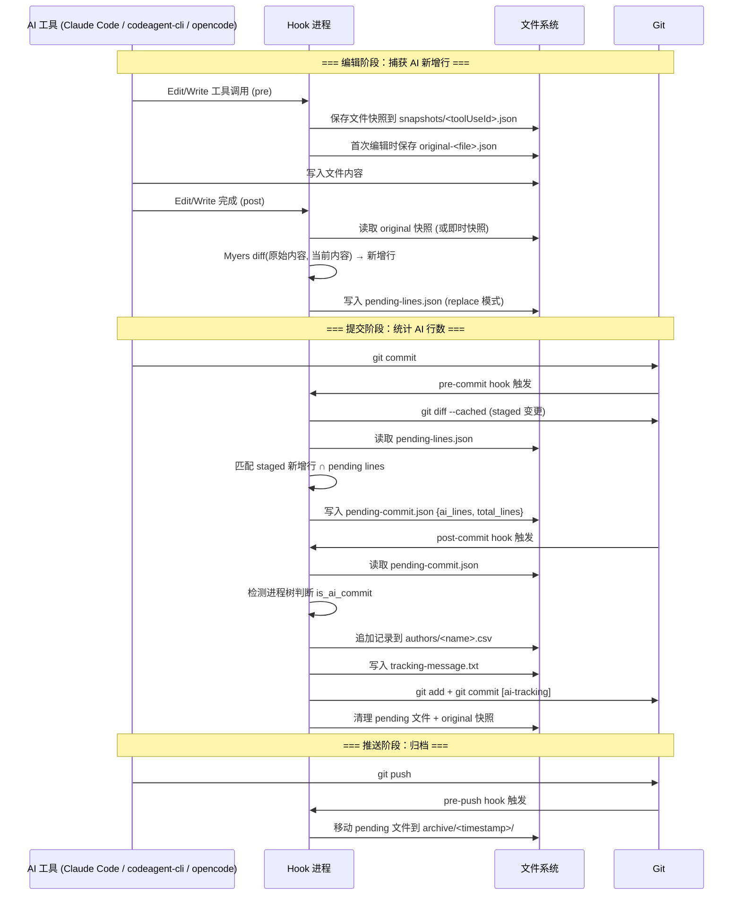

# AI Code Tracker

通过 git hooks 和 AI 工具钩子自动追踪每次 commit 中 AI 生成的代码行数。

## 工作原理

### 整体流程



1. AI 工具（opencode / Claude Code / codeagent-cli）编辑文件前，hook 捕获文件内容快照
2. 编辑完成后，hook 将文件新内容与快照做 diff，计算出 AI 新增的行
3. 新增行记录到 `.ai-tracking/pending-lines.json`
4. `git commit` 时，pre-commit hook 将 pending lines 与 staged diff 匹配，生成统计
5. post-commit hook 将统计数据写入 CSV。`auto_tracking_commit: true`（默认）时还会创建一条追踪提交；`false` 时仅写入工作树，用户自行提交

### Snapshot（快照）

快照是每次编辑文件**之前**捕获的文件内容副本，用于和编辑后的内容做 diff，计算 AI 新增了哪些行。

存储位置：`.ai-tracking/snapshots/`

有两种快照：

- **即时快照**（`<toolUseId>.json`）：每次编辑都重新捕获，post-hook 完成后删除
- **原始快照**（`original-<filename>.json`）：只在文件第一次被编辑时创建，跨多次编辑保留

原始快照的作用：当 AI 对同一个文件多次编辑时，diff 始终从第一次编辑前的基线开始计算，避免中间编辑产生的残留行被重复统计。在 post-commit 时自动清理。

### 支持的 AI 工具

| 工具 | 追踪方式 |
|------|---------|
| opencode | 插件系统（`tool.execute.before/after` 事件，内存中的 Map） |
| Claude Code | Git hooks（每次工具调用启动独立进程，文件系统快照） |
| codeagent-cli | Claude-compatible hooks in `.cac/settings.json` |

## 安装

### 一键安装（同时支持 Claude Code、codeagent-cli 和 opencode）

```bash
node install-to-project.js /path/to/your/project
```

会将插件复制到目标项目的 `.opencode/skills/`、`.claude/skills/` 和 `.cac/skills/`，并自动运行安装脚本。

### 手动安装

#### 在 Claude Code 中安装

1. 将 `.claude/skills/ai-code-tracker/` 复制到目标项目：

```bash
cp -r .claude/skills/ai-code-tracker /path/to/your/project/.claude/skills/
```

2. 在目标项目中运行安装脚本：

```bash
cd /path/to/your/project
node --experimental-vm-modules .claude/skills/ai-code-tracker/scripts/install.js
```

3. 重启 Claude Code 会话，使 hooks 生效。

安装后会自动配置：
- `.claude/settings.json` — PreToolUse / PostToolUse hooks（追踪 Edit/Write/Bash 操作）
- `.claude/commands/ai-*.md` — 5 个 slash 命令（`/project:ai-install`、`/project:ai-check`、`/project:ai-repair`、`/project:ai-stats`、`/project:ai-uninstall`）
- `.git/hooks/` — git hooks（pre-commit、post-commit、pre-push、post-rewrite）
- `.ai-tracking/config.json` — 本地配置

#### 在 opencode 中安装

1. 将 `.opencode/skills/ai-code-tracker/` 复制到目标项目：

```bash
cp -r .opencode/skills/ai-code-tracker /path/to/your/project/.opencode/skills/
```

2. 在目标项目中运行安装脚本：

```bash
cd /path/to/your/project
node --experimental-vm-modules .opencode/skills/ai-code-tracker/scripts/install.js
```

3. 重启 opencode 会话，使插件生效。

安装后会自动配置：
- `.opencode/plugins/ai-code-tracker.js` — opencode 插件
- `.opencode/commands/ai-*.md` — 5 个 slash 命令（`/ai-install`、`/ai-check`、`/ai-repair`、`/ai-stats`、`/ai-uninstall`）
- `.git/hooks/` — git hooks（pre-commit、post-commit、pre-push、post-rewrite）
- `.ai-tracking/config.json` — 本地配置

#### 在 codeagent-cli 中安装

1. 将 `.cac/skills/ai-code-tracker/` 复制到目标项目：

```bash
cp -r .cac/skills/ai-code-tracker /path/to/your/project/.cac/skills/
```

2. 在目标项目中运行安装脚本：

```bash
cd /path/to/your/project
node --experimental-vm-modules .cac/skills/ai-code-tracker/scripts/install.js
```

3. 重启 codeagent-cli 会话，使 hooks 生效。

安装后会自动配置：
- `.cac/settings.json` — PreToolUse / PostToolUse hooks（追踪 Edit/Write/Bash 操作）
- `.cac/commands/ai-*.md` — slash 命令
- `.git/hooks/` — git hooks（pre-commit、post-commit、pre-push、post-rewrite）
- `.ai-tracking/config.json` — 本地配置

### 验证安装

```bash
# Claude Code 用户
node .claude/skills/ai-code-tracker/scripts/install.js --check

# opencode 用户
node .opencode/skills/ai-code-tracker/scripts/install.js --check

# codeagent-cli 用户
node .cac/skills/ai-code-tracker/scripts/install.js --check
```

### 注意事项

- **Node.js 版本**：需要 Node.js 20.9+（使用 `--experimental-vm-modules` 启动 ES 模块）
- **commit message 中不要手动加 `[ai-tracking]`**：追踪器会在 post-commit 时自动追加此后缀。手动添加会导致 post-commit hook 跳过该提交，CSV 中不会记录。
- `.claude/`、`.cac/` 和 `.opencode/` 互相独立，可以只安装其中一个，也可以同时安装。

## 配置

安装后自动生成 `.ai-tracking/config.json`（提交到代码仓，团队共享配置）：

```json
{
  "enabled": true,
  "count_blank_lines": false,
  "tracking_commit_suffix": "[ai-tracking]",
  "auto_tracking_commit": true
}
```

| 配置项 | 类型 | 默认值 | 说明 |
|--------|------|--------|------|
| `enabled` | boolean | `true` | 设为 `false` 完全关闭追踪（hook 入口、git hooks 全部跳过） |
| `count_blank_lines` | boolean | `false` | 是否将空行计入 total_lines |
| `tracking_commit_suffix` | string | `"[ai-tracking]"` | 追踪 commit message 的后缀标记。设为空串 `""` 表示不追加后缀，改为 amend CSV 进原始 commit |
| `auto_tracking_commit` | boolean | `true` | 设为 `false` 时 CSV 仅写入工作树，不 stage 不 commit，由用户自行决定是否提交 |

#### CSV 已包含在 commit 中时的行为

无论 `auto_tracking_commit` 取何值，post-commit hook 都会检测当前 commit 是否已经改动了对应作者的 CSV 文件。如果已改动（例如你手动 `git add` 了 CSV），hook 会跳过，既不追加新记录也不创建追踪 commit，视为你自行处理了该 commit 的统计。

#### `auto_tracking_commit: false` 行为

此模式下 post-commit hook 仅在当前 commit **没有包含 CSV 变更**时写入一条记录到工作树。如果 commit 本身已经改了 CSV（例如你自己 stage 了 CSV），hook 会跳过，不会追加新行。记录留在工作树中由你自行决定何时 `git add` + `git commit`。

以下目录始终忽略，不可配置：`.ai-tracking/`、`.git/`、`node_modules/`、`dist/`、`build/`

## 数据存储

所有追踪数据存储在项目的 `.ai-tracking/` 目录中（临时文件已 gitignore，`config.json` 提交到代码仓）：

```
.ai-tracking/
├── config.json              # 本地配置（enabled, count_blank_lines 等）
├── pending-lines.json       # AI 编辑文件后记录的新增行，等 git commit 时与 staged diff 匹配
├── pending-commit.json      # pre-commit 计算出的统计结果，传递给 post-commit 使用
├── tracking-message.txt     # [ai-tracking] 追踪 commit 的 message 内容
├── plugin.log               # 运行日志（所有 hook 和安装操作的记录）
├── snapshots/               # 编辑前的文件快照（用于 diff 计算新增行）
├── authors/
│   └── <作者名>.csv         # 最终统计结果，每行一个 commit 的 AI 行数/总行数
└── archive/                 # git push 后归档的 pending 文件
```

### 文件生命周期

```
AI 编辑文件 → pending-lines.json 记录新增行
                    ↓
git commit (pre-commit) → pending-commit.json 记录统计结果
                    ↓
git commit (post-commit) → authors/*.csv 写入最终记录
                    │
                    ├─ auto_tracking: true  → [ai-tracking] commit（自动提交 CSV）
                    └─ auto_tracking: false → 仅写入工作树，用户自行决定是否提交 CSV
                    ↓
git push (pre-push) → archive/ 归档清理
```

## 日志排查

所有 hook 和安装操作的日志写入 `.ai-tracking/plugin.log`，自动轮转（单文件最大 5MB，保留 3 个归档）。

### 日志格式

```
[时间戳(UTC)] [级别] [事件来源] 描述 {JSON附加信息}
```

示例：

```
[2026-05-14T15:03:11.921Z] [INFO] [commit-stats.pre-commit] enter
[2026-05-14T15:03:11.945Z] [INFO] [pre-commit] complete {"stagedFiles":23,"totalAddedLines":1288,"aiLines":0,"isAiCommit":true,"durationMs":17}
[2026-05-14T15:03:11.994Z] [INFO] [post-commit] processing commit {"subject":"fix: xxx","aiLines":3,"totalLines":4}
[2026-05-14T16:33:45.691Z] [INFO] [claude-code.pre] captured snapshot {"file":"test.js"}
[2026-05-14T16:33:54.272Z] [INFO] [claude-code.post] recorded added lines {"file":"test.js","addedLines":5}
```

### 常见事件来源

| 事件 | 含义 |
|------|------|
| `claude-code.pre` / `claude-code.post` | Claude Code 工具调用的前后 hook |
| `claude-code.bash-pre` / `claude-code.bash-post` | Bash 命令执行的前后 hook |
| `pre-commit` / `post-commit` / `pre-push` | Git hooks 触发的统计流程 |
| `install` / `install.check` / `install.repair` | 安装/检查/修复操作 |
| `plugin.init` | opencode 插件初始化 |

### 排查方法

```bash
# 查看最近的 hook 活动
tail -20 .ai-tracking/plugin.log

# 查看 commit 统计是否被跳过
grep "skipped" .ai-tracking/plugin.log

# 查看某个文件的 pending lines 记录
grep "test.js" .ai-tracking/plugin.log

# 只看错误
grep "\[ERROR\]" .ai-tracking/plugin.log

# 查看 post-commit 的完整统计结果
grep "post-commit.*complete" .ai-tracking/plugin.log
```

## AI 代码占比不达 100% 的排查记录

### 1. Write 创建新文件未追踪

**现象**：AI 用 Write 工具创建新文件，AI 行数为 0。

**原因**：`recordEditedFile` 在 `before` 为空时直接跳过，不记录新增行。

**修复**：`before` 为空时视为新文件，将 `after` 的全部行作为新增行记录。

### 2. 多次编辑同一文件产生残留行

**现象**：AI 编辑同一文件两次（如 A→B→C），pending lines 中保留了第一次编辑的中间状态行（B），导致行数膨胀，匹配率下降。

**原因**：每次 post-hook 将 diff 结果追加到 pending lines，没有清除上一次的记录。

**修复**：引入原始快照（originalSnapshot），post-hook 始终从第一次编辑前的基线做 diff。使用 `replace: true` 模式覆盖而非追加 pending lines。

### 3. Multiset diff 低估新增行数

**现象**：pending lines 行数少于 git diff 实际行数（如 89/127）。

**原因**：旧 diff 算法用 multiset（袋集合）匹配，忽略行位置。当行顺序变化时（删除后重排），无法正确识别所有新增行。

**修复**：替换为 Myers diff 算法，按位置匹配，和 `git diff` 行为一致。

### 4. 原始快照跨 commit 未清理

**现象**：commit 后再次编辑同一文件，diff 基线是上一次 commit 前的状态，导致匹配偏差（如 56/66）。

**原因**：`original-*.json` 快照在 commit 后没有被清理，下次编辑时仍从旧基线 diff。

**修复**：post-commit hook 中增加 `cleanOriginalSnapshots()`，清理所有原始快照文件。

### 5. total_lines 包含空行但 pending lines 不含空行

**现象**：非空行全部匹配，但 total_lines 大于 ai_lines（如 39/63）。

**原因**：`buildPendingCommit` 用 git diff 的全部行计算 total_lines，但 pending lines 在 `count_blank_lines: false` 时过滤了空行，分母比分子大。

**修复**：`buildPendingCommit` 接受 `countBlankLines` 参数，计算 total_lines 时同步过滤空行。

### 6. 同一批次内重复行被错误去重

**现象**：文件中有重复内容的行（如测试代码），pending lines 去重后行数少于 diff 行数（如 22/29）。

**原因**：`appendPendingLines` 的 `dedupeExisting` 在添加每行后执行 `existing.add(line)`，导致同一批次输入中的重复行也被跳过。

**修复**：去掉 `existing.add(line)`，`dedupeExisting` 只检查已有的 base 记录，同一批次内的重复行各自保留。

### 7. Bash hook 跳过已追踪文件导致 cp 同步丢失行

**现象**：使用 `cp` 命令同步文件（如 `cp src/x.js .claude/skills/.../lib/x.js`）后提交，AI 行数达不到 100%（如 273/287）。

**原因**：`handleBashAfter` 中 `if (pending[file]) continue` 检查导致已有 pending lines 的文件被跳过。当工作流为：Edit 源文件 → cp 同步（Bash 追踪副本）→ 继续编辑源文件 → 再次 cp 同步时，第二次 cp 更新了文件内容，但 Bash hook 因文件已有 pending lines 而跳过，新增行未被记录。

**修复**：移除 `pending[file]` 跳过逻辑，改用 `replace: true` 模式写入完整文件内容。Bash hook 始终用最新文件内容替换 pending lines，确保多次 Bash 命令对同一文件的修改不会丢失。

### 8. 安装目录 lib 未同步最新修复

**现象**：所有修复都已提交，但 commit 统计仍未改善。

**原因**：git hooks 和 Claude Code hooks 运行的是 `.opencode/skills/ai-code-tracker/lib/` 下的安装副本，不是 `src/`。修改 `src/` 后没有同步到 lib。

**修复**：将 `src/` 所有文件同步到 `.opencode/skills/ai-code-tracker/lib/`。开发时需注意每次修改 `src/` 后都要同步。

### 9. opencode 中 Bash 命令变更的文件未被追踪

**现象**：在 opencode 中通过 Bash 工具修改文件（如 `cp`、重定向写入），AI 行数为 0。

**原因**：opencode 的 `tool.execute.after` 事件在 Bash 命令完成时触发，但该事件并不可靠——有时不触发或触发时序过晚。依赖单一 `tool.execute.after` 捕获 Bash 变更会漏掉大量文件修改。

**修复**：在 `handleBashBefore` 中增加 3 秒定时器作为 fallback。每次 Bash 命令开始时捕获文件 hash 基线，3 秒后自动对比当前 hash，发现变更立即记录。即使 `tool.execute.after` 未触发或延迟，定时器也能捕获变更。

### 10. shouldIgnore glob 匹配错误跳过 .gitignore 等文件

**现象**：编辑 `.gitignore` 文件后，AI 行数为 0。日志显示 `skipped: ignored`。

**原因**：`shouldIgnore` 函数中 `.git/**` 的 glob 匹配使用 `pattern.slice(0, -3)` 截取前缀为 `.git`，导致所有以 `.git` 开头的文件（如 `.gitignore`、`.github/`）都被误判为应忽略的文件。

**修复**：改为 `pattern.slice(0, -2)` 保留尾部 `/`，前缀变为 `.git/`，确保只匹配 `.git/` 目录下的文件。

### 11. tracking_commit_suffix 设为空串无效

**现象**：将 `config.json` 中 `tracking_commit_suffix` 设为 `""`，提交时仍追加 `[ai-tracking]` 后缀。

**原因**：代码使用 `config.tracking_commit_suffix || "[ai-tracking]"` 获取后缀，空串 `""` 是 falsy 值，被 `||` 运算符跳过，回退到默认值。此外 `"".includes("")` 始终为 `true`，导致 post-commit 跳过所有 commit。

**修复**：用 `!== undefined && !== null` 判断用户是否配置了后缀，空串视为合法值（不追加后缀）。suffix 为空时跳过 includes 检查，并在 autoTracking 分支中改用 `--amend` 直接将 CSV 追加到原始 commit。

### 12. commit 前重命名文件导致 pending lines 匹配不到

**现象**：AI 先修复代码或创建新文件，`pending-lines.json` 已经记录了旧路径下的 AI 新增行；commit 前文件被重命名后，提交统计中 AI 行数为 0 或明显偏低。

**原因**：编辑阶段的 pending lines 按编辑时路径存储，例如 `src/draft.js`；commit 阶段的 staged diff 使用提交时的新路径，例如 `src/final.js`。旧逻辑只按同一路径匹配 `pendingLines[filePath]`，不会把旧路径的 pending 记录映射到新路径。对于从未 commit 过的新文件，Git 也不一定能识别 rename，通常只看到一个新文件。

**修复**：pre-commit 阶段使用 `git diff --cached --find-renames` 提取 Git rename 映射，并在 `buildPendingCommit` 中支持旧路径到新路径匹配。对于新建后改名、Git 无法识别 rename 的场景，增加“pending 旧路径已不存在时按内容匹配新 staged 文件”的兜底逻辑。`matched_lines` 仍记录原 pending 路径，确保 post-commit 能正确消费旧路径下的 pending 行。

### 13. pruneStaleRecords 清空其他用户/分支的 CSV 记录

**现象**：用户 A 在自己分支 `feature-a` commit 后，用户 B 在另一分支 `feature-b` 的 CSV 记录被清空。

**原因**：`pruneCsvRecordsIfPossible` 在每次 commit 前用 `git merge-base --is-ancestor <commit_id> HEAD` 检查所有 `.csv` 文件的每个 commit_id。如果某个 commit_id 不是当前分支 HEAD 的祖先（例如在另一分支上），该记录会被删除。且 `pruneStaleRecords` 遍历 `.ai-tracking/` 下所有 `.csv` 文件，不限制作者。

**修复**：
- `pruneStaleRecords` 新增 `author` 参数，只处理当前作者的 `.csv` 文件
- `pruneCsvRecordsIfPossible` 改用 `git branch --all --contains <commit_id>` 判断 commit 是否存在于**任一分支**，而非仅当前 HEAD

### 14. Cherry-pick 后旧 commit 记录被 prune 误删

**现象**：从其他分支 cherry-pick 一个 commit 后，新 commit 生成新 ID，旧 commit ID 的记录在下次 commit 时被 prune 删除。

**原因**：旧逻辑使用 `git merge-base --is-ancestor <commit_id> HEAD` 判断 commit 是否存活。Cherry-pick 的源 commit 不在当前分支的祖先链中，被误判为 stale 删除。

**修复**：与问题 13 相同，改用 `git branch --all --contains <commit_id>`。源 commit 存在于源分支中（如 `main`），不会被误删。新旧两条记录共存，AI lines 均已正确记录。

### 15. 快速 Bash 命令因 baseline 竞态未被追踪

**现象**：在 opencode 中用快速 Bash 命令（如 `cp` 覆盖已追踪文件）修改文件后，日志显示 `trackedFiles:0`，AI 行数丢失。慢命令（如 `sleep 2 && cp`）则正常追踪。

**原因**：opencode 触发 `tool.execute.before` 钩子后**不会等待其完成**就开始执行 Bash 命令。`handleBashBefore` 中的 `captureGitFileHashes` 需要执行 3 次 git 命令并读取所有变更文件内容，耗时较长。对于快速命令（如 `cp`），Bash 在 baseline 完成前就执行完毕，baseline 读到的是**命令执行后**的文件内容。到 `handleBashAfter` 比较时，`prevHashes[file] === currentHashes[file]`（两者都是命令后的内容），判定为"未变更"而跳过。

慢命令（如 `sleep 2 && cp`）在 sleep 期间 baseline 有足够时间读取命令前的内容，因此能正确检测变更。

**修复**：`recordBashChanges` 改用混合策略，不再仅依赖可能竞态的 `prevHashes` baseline：

- **文件已在 pending-lines 中**（之前被 Write/Edit 追踪过）：直接对比当前文件内容与 pending-lines 中已记录的内容。若不同则记录（`replace: true`），相同则跳过。此路径完全绕开 baseline，不受竞态影响。
- **文件不在 pending-lines 中**（新文件，未被 AI 工具编辑过）：回退到 `prevHashes` baseline 比较。这类文件竞态概率低（新文件在 baseline 执行时通常还不存在）。

## 已知限制

### 并行编辑导致 AI 行数偏低

当 AI 工具同时编辑多个文件时（如两个并行的 Edit 操作），每个操作的 hook 独立执行。如果两次编辑涉及相同的代码变更，pre-hook 的快照时序可能出现竞争，导致其中一个文件的 diff 结果不完整，ai_lines < total_lines。

这不是代码 bug，而是并发 hook 执行的固有限制。实际影响很小（通常差 1 行），且只出现在同一 commit 内并行编辑多个文件的场景。

## 卸载

```bash
# Claude Code 用户
node .claude/skills/ai-code-tracker/scripts/install.js --uninstall

# opencode 用户
node .opencode/skills/ai-code-tracker/scripts/install.js --uninstall

# codeagent-cli 用户
node .cac/skills/ai-code-tracker/scripts/install.js --uninstall
```

移除所有 git hooks、AI 工具钩子、插件和命令文件。统计数据（`.ai-tracking/authors/`）不会被删除。

## 开发

```bash
# 运行测试
npm test

# 修改 src 后重新构建 lib（自动同步到 .opencode/、.claude/ 和 .cac/）
npm run build
```
